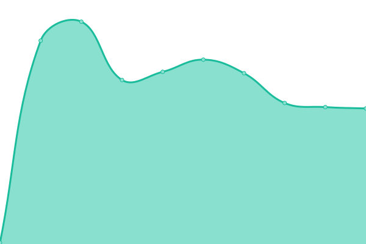
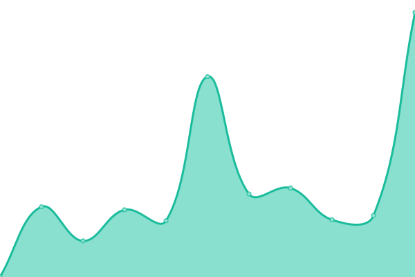
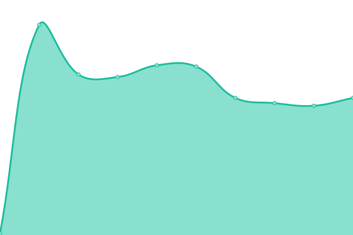

# [📈 Live Status](https://FoodCoopX.github.io/upptime): <!--live status--> **🟩 All systems operational**

This repository contains the open-source uptime monitor and status page for [FoodCoopX UG (haftungsbeschränkt)](https://www.foodcoopx.de), powered by [Upptime](https://github.com/upptime/upptime).

With [Upptime](https://upptime.js.org), you can get your own unlimited and free uptime monitor and status page, powered entirely by a GitHub repository. We use [Issues](https://github.com/FoodCoopX/upptime/issues) as incident reports, [Actions](https://github.com/FoodCoopX/upptime/actions) as uptime monitors, and [Pages](https://FoodCoopX.github.io/upptime) for the status page.

<!--start: status pages-->
<!-- This summary is generated by Upptime (https://github.com/upptime/upptime) -->
<!-- Do not edit this manually, your changes will be overwritten -->
<!-- prettier-ignore -->
| URL | Status | History | Response Time | Uptime |
| --- | ------ | ------- | ------------- | ------ |
|  [WirGarten Lüneburg Tapir](https://mitglieder.lueneburg.wirgarten.com) | 🟩 Up | [wir-garten-lueneburg-tapir.yml](https://github.com/FoodCoopX/upptime/commits/HEAD/history/wir-garten-lueneburg-tapir.yml) | 

 1421ms
     
 | 

<a href="https://FoodCoopX.github.io/upptime/history/wir-garten-lueneburg-tapir">100.00%</a>
    

|  [Keycloak WirGarten Lüneburg Tapir](https://kc.lueneburg.wirgarten.com) | 🟩 Up | [keycloak-wir-garten-lueneburg-tapir.yml](https://github.com/FoodCoopX/upptime/commits/HEAD/history/keycloak-wir-garten-lueneburg-tapir.yml) | 

 122ms
     
 | 

<a href="https://FoodCoopX.github.io/upptime/history/keycloak-wir-garten-lueneburg-tapir">100.00%</a>
    

|  [Möllers Morgen](https://solawi.moellersmorgen.de) | 🟩 Up | [moellers-morgen.yml](https://github.com/FoodCoopX/upptime/commits/HEAD/history/moellers-morgen.yml) | 

 1905ms
     
 | 

<a href="https://FoodCoopX.github.io/upptime/history/moellers-morgen">100.00%</a>
    

|  [Keycloak Möllers Morgen](https://auth.mm-prod.foodcoopx.de) | 🟩 Up | [keycloak-moellers-morgen.yml](https://github.com/FoodCoopX/upptime/commits/HEAD/history/keycloak-moellers-morgen.yml) | 

 122ms
     
 | 

<a href="https://FoodCoopX.github.io/upptime/history/keycloak-moellers-morgen">100.00%</a>
    

|  [Gemüsekollektiv](https://solawi.gemuesekollektiv.org) | 🟩 Up | [gemuesekollektiv.yml](https://github.com/FoodCoopX/upptime/commits/HEAD/history/gemuesekollektiv.yml) | 

 1766ms
     
 | 

<a href="https://FoodCoopX.github.io/upptime/history/gemuesekollektiv">100.00%</a>
    

|  [Keycloak Gemüsekollektiv](https://auth.solawi.gemuesekollektiv.org) | 🟩 Up | [keycloak-gemuesekollektiv.yml](https://github.com/FoodCoopX/upptime/commits/HEAD/history/keycloak-gemuesekollektiv.yml) | 

 121ms
     
 | 

<a href="https://FoodCoopX.github.io/upptime/history/keycloak-gemuesekollektiv">100.00%</a>
    

|  [Grüne Neune Hammelburg](https://solawi.grueneneune-hammelburg.de) | 🟩 Up | [gruene-neune-hammelburg.yml](https://github.com/FoodCoopX/upptime/commits/HEAD/history/gruene-neune-hammelburg.yml) | 

 1856ms
     
 | 

<a href="https://FoodCoopX.github.io/upptime/history/gruene-neune-hammelburg">100.00%</a>
    

|  [Keycloak Grüne Neune Hammelburg](https://auth.solawi.grueneneune-hammelburg.de) | 🟩 Up | [keycloak-gruene-neune-hammelburg.yml](https://github.com/FoodCoopX/upptime/commits/HEAD/history/keycloak-gruene-neune-hammelburg.yml) | 

 121ms
     
 | 

<a href="https://FoodCoopX.github.io/upptime/history/keycloak-gruene-neune-hammelburg">100.00%</a>
    

<!--end: status pages-->

[**Visit our status website →**](https://FoodCoopX.github.io/upptime)

## 📄 License

- Powered by: [Upptime](https://github.com/upptime/upptime)
- Code: [MIT](./LICENSE) © [Anand Chowdhary](https://anandchowdhary.com), supported by [Pabio](https://pabio.com)
- Data in the `./history` directory: [Open Database License](https://opendatacommons.org/licenses/odbl/1-0/)
