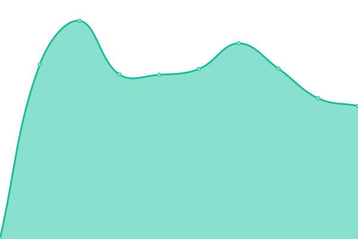
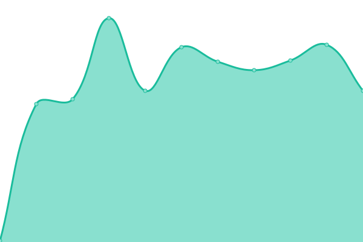
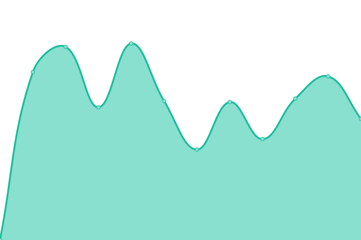

# [📈 Live Status](https://FoodCoopX.github.io/upptime): <!--live status--> **🟩 All systems operational**

This repository contains the open-source uptime monitor and status page for [FoodCoopX UG (haftungsbeschränkt)](https://www.foodcoopx.de), powered by [Upptime](https://github.com/upptime/upptime).

With [Upptime](https://upptime.js.org), you can get your own unlimited and free uptime monitor and status page, powered entirely by a GitHub repository. We use [Issues](https://github.com/FoodCoopX/upptime/issues) as incident reports, [Actions](https://github.com/FoodCoopX/upptime/actions) as uptime monitors, and [Pages](https://FoodCoopX.github.io/upptime) for the status page.

<!--start: status pages-->
<!-- This summary is generated by Upptime (https://github.com/upptime/upptime) -->
<!-- Do not edit this manually, your changes will be overwritten -->
<!-- prettier-ignore -->
| URL | Status | History | Response Time | Uptime |
| --- | ------ | ------- | ------------- | ------ |
|  [WirGarten Lüneburg Tapir](https://mitglieder.lueneburg.wirgarten.com) | 🟩 Up | [wir-garten-lueneburg-tapir.yml](https://github.com/FoodCoopX/upptime/commits/HEAD/history/wir-garten-lueneburg-tapir.yml) | 

 1446ms
     
 | 

<a href="https://FoodCoopX.github.io/upptime/history/wir-garten-lueneburg-tapir">99.58%</a>
    

|  [Keycloak WirGarten Lüneburg Tapir](https://kc.lueneburg.wirgarten.com) | 🟩 Up | [keycloak-wir-garten-lueneburg-tapir.yml](https://github.com/FoodCoopX/upptime/commits/HEAD/history/keycloak-wir-garten-lueneburg-tapir.yml) | 

 148ms
     
 | 

<a href="https://FoodCoopX.github.io/upptime/history/keycloak-wir-garten-lueneburg-tapir">100.00%</a>
    

|  [WirGarten Lüneburg BestellWizard](https://mitglieder.lueneburg.wirgarten.com/tapir/register) | 🟩 Up | [wir-garten-lueneburg-bestell-wizard.yml](https://github.com/FoodCoopX/upptime/commits/HEAD/history/wir-garten-lueneburg-bestell-wizard.yml) | 

 657ms
     
 | 

<a href="https://FoodCoopX.github.io/upptime/history/wir-garten-lueneburg-bestell-wizard">99.58%</a>
    

|  [Möllers Morgen](https://solawi.moellersmorgen.de) | 🟩 Up | [moellers-morgen.yml](https://github.com/FoodCoopX/upptime/commits/HEAD/history/moellers-morgen.yml) | 

 1934ms
     
 | 

<a href="https://FoodCoopX.github.io/upptime/history/moellers-morgen">98.38%</a>
    

|  [Keycloak Möllers Morgen](https://auth.mm-prod.foodcoopx.de) | 🟩 Up | [keycloak-moellers-morgen.yml](https://github.com/FoodCoopX/upptime/commits/HEAD/history/keycloak-moellers-morgen.yml) | 

 147ms
     
 | 

<a href="https://FoodCoopX.github.io/upptime/history/keycloak-moellers-morgen">100.00%</a>
    

|  [Möllers Morgen BestellWizard](https://solawi.moellersmorgen.de/tapir/register) | 🟩 Up | [moellers-morgen-bestell-wizard.yml](https://github.com/FoodCoopX/upptime/commits/HEAD/history/moellers-morgen-bestell-wizard.yml) | 

 446ms
     
 | 

<a href="https://FoodCoopX.github.io/upptime/history/moellers-morgen-bestell-wizard">98.38%</a>
    

|  [Gemüsekollektiv (GKH)](https://solawi.gemuesekollektiv.org) | 🟩 Up | [gemuesekollektiv-gkh.yml](https://github.com/FoodCoopX/upptime/commits/HEAD/history/gemuesekollektiv-gkh.yml) | 

 1934ms
     
 | 

<a href="https://FoodCoopX.github.io/upptime/history/gemuesekollektiv-gkh">99.24%</a>
    

|  [Keycloak Gemüsekollektiv](https://auth.solawi.gemuesekollektiv.org) | 🟩 Up | [keycloak-gemuesekollektiv.yml](https://github.com/FoodCoopX/upptime/commits/HEAD/history/keycloak-gemuesekollektiv.yml) | 

 146ms
     
 | 

<a href="https://FoodCoopX.github.io/upptime/history/keycloak-gemuesekollektiv">99.24%</a>
    

|  [Gemüsekollektiv BestellWizard](https://solawi.gemuesekollektiv.org/tapir/register) | 🟩 Up | [gemuesekollektiv-bestell-wizard.yml](https://github.com/FoodCoopX/upptime/commits/HEAD/history/gemuesekollektiv-bestell-wizard.yml) | 

 635ms
     
 | 

<a href="https://FoodCoopX.github.io/upptime/history/gemuesekollektiv-bestell-wizard">100.00%</a>
    

|  [Grüne Neune Hammelburg (G9H)](https://solawi.grueneneune-hammelburg.de) | 🟩 Up | [gruene-neune-hammelburg-g9-h.yml](https://github.com/FoodCoopX/upptime/commits/HEAD/history/gruene-neune-hammelburg-g9-h.yml) | 

 2078ms
     
 | 

<a href="https://FoodCoopX.github.io/upptime/history/gruene-neune-hammelburg-g9-h">100.00%</a>
    

|  [Keycloak Grüne Neune Hammelburg](https://auth.solawi.grueneneune-hammelburg.de) | 🟩 Up | [keycloak-gruene-neune-hammelburg.yml](https://github.com/FoodCoopX/upptime/commits/HEAD/history/keycloak-gruene-neune-hammelburg.yml) | 

 146ms
     
 | 

<a href="https://FoodCoopX.github.io/upptime/history/keycloak-gruene-neune-hammelburg">100.00%</a>
    

|  [Grüne Neune Hammelburg BestellWizard](https://solawi.grueneneune-hammelburg.de/tapir/register) | 🟩 Up | [gruene-neune-hammelburg-bestell-wizard.yml](https://github.com/FoodCoopX/upptime/commits/HEAD/history/gruene-neune-hammelburg-bestell-wizard.yml) | 

 258ms
     
 | 

<a href="https://FoodCoopX.github.io/upptime/history/gruene-neune-hammelburg-bestell-wizard">100.00%</a>
    

|  [Ernte Union Ost (EUO)](https://solawi.ernte-union-ost.de) | 🟩 Up | [ernte-union-ost-euo.yml](https://github.com/FoodCoopX/upptime/commits/HEAD/history/ernte-union-ost-euo.yml) | 

 1645ms
     
 | 

<a href="https://FoodCoopX.github.io/upptime/history/ernte-union-ost-euo">100.00%</a>
    

|  [Keycloak Ernte Union Ost](https://auth.solawi.ernte-union-ost.de) | 🟩 Up | [keycloak-ernte-union-ost.yml](https://github.com/FoodCoopX/upptime/commits/HEAD/history/keycloak-ernte-union-ost.yml) | 

 148ms
     
 | 

<a href="https://FoodCoopX.github.io/upptime/history/keycloak-ernte-union-ost">100.00%</a>
    

|  [Ernte Union Ost BestellWizard](https://solawi.ernte-union-ost.de/bestell_wizard/bestell_wizard_mobile) | 🟩 Up | [ernte-union-ost-bestell-wizard.yml](https://github.com/FoodCoopX/upptime/commits/HEAD/history/ernte-union-ost-bestell-wizard.yml) | 

 281ms
     
 | 

<a href="https://FoodCoopX.github.io/upptime/history/ernte-union-ost-bestell-wizard">100.00%</a>
    

|  [Solawi Hall (HAL)](https://mitglieder.solawi-hall.de) | 🟩 Up | [solawi-hall-hal.yml](https://github.com/FoodCoopX/upptime/commits/HEAD/history/solawi-hall-hal.yml) | 

 1652ms
     
 | 

<a href="https://FoodCoopX.github.io/upptime/history/solawi-hall-hal">100.00%</a>
    

|  [Keycloak Solawi Hall](https://auth.mitglieder.solawi-hall.de) | 🟩 Up | [keycloak-solawi-hall.yml](https://github.com/FoodCoopX/upptime/commits/HEAD/history/keycloak-solawi-hall.yml) | 

 150ms
     
 | 

<a href="https://FoodCoopX.github.io/upptime/history/keycloak-solawi-hall">100.00%</a>
    

|  [Solawi Hall BestellWizard](https://mitglieder.solawi-hall.de/bestell_wizard/bestell_wizard_mobile) | 🟩 Up | [solawi-hall-bestell-wizard.yml](https://github.com/FoodCoopX/upptime/commits/HEAD/history/solawi-hall-bestell-wizard.yml) | 

 168ms
     
 | 

<a href="https://FoodCoopX.github.io/upptime/history/solawi-hall-bestell-wizard">100.00%</a>
    

|  [Humuswerkstatt (HUW)](https://solawi.humuswerkstatt.de) | 🟩 Up | [humuswerkstatt-huw.yml](https://github.com/FoodCoopX/upptime/commits/HEAD/history/humuswerkstatt-huw.yml) | 

 1565ms
     
 | 

<a href="https://FoodCoopX.github.io/upptime/history/humuswerkstatt-huw">100.00%</a>
    

|  [Keycloak Humuswerkstatt](https://auth.mitglieder.solawi-hall.de) | 🟩 Up | [keycloak-humuswerkstatt.yml](https://github.com/FoodCoopX/upptime/commits/HEAD/history/keycloak-humuswerkstatt.yml) | 

 150ms
     
 | 

<a href="https://FoodCoopX.github.io/upptime/history/keycloak-humuswerkstatt">100.00%</a>
    

|  [Humuswerkstatt BestellWizard](https://mitglieder.solawi-hall.de/bestell_wizard/bestell_wizard_mobile) | 🟩 Up | [humuswerkstatt-bestell-wizard.yml](https://github.com/FoodCoopX/upptime/commits/HEAD/history/humuswerkstatt-bestell-wizard.yml) | 

 169ms
     
 | 

<a href="https://FoodCoopX.github.io/upptime/history/humuswerkstatt-bestell-wizard">100.00%</a>
    

|  [Katringer Grünzeug (KGZ)](https://tapir.katringer-gruenzeug.de) | 🟩 Up | [katringer-gruenzeug-kgz.yml](https://github.com/FoodCoopX/upptime/commits/HEAD/history/katringer-gruenzeug-kgz.yml) | 

 1630ms
     
 | 

<a href="https://FoodCoopX.github.io/upptime/history/katringer-gruenzeug-kgz">97.13%</a>
    

|  [Keycloak Katringer Grünzeug](https://auth.tapir.katringer-gruenzeug.de) | 🟩 Up | [keycloak-katringer-gruenzeug.yml](https://github.com/FoodCoopX/upptime/commits/HEAD/history/keycloak-katringer-gruenzeug.yml) | 

 143ms
     
 | 

<a href="https://FoodCoopX.github.io/upptime/history/keycloak-katringer-gruenzeug">97.45%</a>
    

|  [Katringer Grünzeug BestellWizard](https://tapir.katringer-gruenzeug.de/bestell_wizard/bestell_wizard_mobile) | 🟩 Up | [katringer-gruenzeug-bestell-wizard.yml](https://github.com/FoodCoopX/upptime/commits/HEAD/history/katringer-gruenzeug-bestell-wizard.yml) | 

 165ms
     
 | 

<a href="https://FoodCoopX.github.io/upptime/history/katringer-gruenzeug-bestell-wizard">100.00%</a>
    

<!--end: status pages-->

[**Visit our status website →**](https://FoodCoopX.github.io/upptime)

## 📄 License

- Powered by: [Upptime](https://github.com/upptime/upptime)
- Code: [MIT](./LICENSE) © [Anand Chowdhary](https://anandchowdhary.com), supported by [Pabio](https://pabio.com)
- Data in the `./history` directory: [Open Database License](https://opendatacommons.org/licenses/odbl/1-0/)
