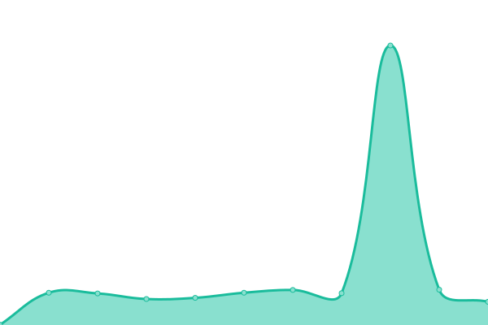
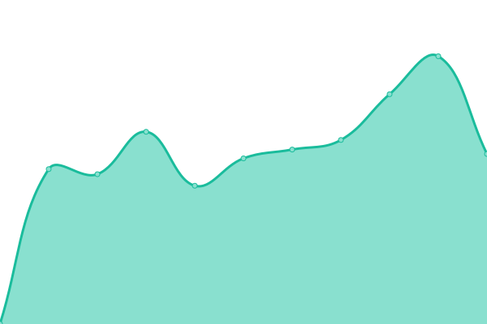

# [📈 Live Status](https://FoodCoopX.github.io/upptime): <!--live status--> **🟧 Partial outage**

This repository contains the open-source uptime monitor and status page for [FoodCoopX UG (haftungsbeschränkt)](https://www.foodcoopx.de), powered by [Upptime](https://github.com/upptime/upptime).

With [Upptime](https://upptime.js.org), you can get your own unlimited and free uptime monitor and status page, powered entirely by a GitHub repository. We use [Issues](https://github.com/FoodCoopX/upptime/issues) as incident reports, [Actions](https://github.com/FoodCoopX/upptime/actions) as uptime monitors, and [Pages](https://FoodCoopX.github.io/upptime) for the status page.

<!--start: status pages-->
<!-- This summary is generated by Upptime (https://github.com/upptime/upptime) -->
<!-- Do not edit this manually, your changes will be overwritten -->
<!-- prettier-ignore -->
| URL | Status | History | Response Time | Uptime |
| --- | ------ | ------- | ------------- | ------ |
|  [WirGarten Lüneburg Tapir](https://mitglieder.lueneburg.wirgarten.com) | 🟩 Up | [wir-garten-lueneburg-tapir.yml](https://github.com/FoodCoopX/upptime/commits/HEAD/history/wir-garten-lueneburg-tapir.yml) | 

 1325ms
     
 | 

<a href="https://FoodCoopX.github.io/upptime/history/wir-garten-lueneburg-tapir">100.00%</a>
    

|  [Keycloak WirGarten Lüneburg Tapir](https://kc.lueneburg.wirgarten.com) | 🟩 Up | [keycloak-wir-garten-lueneburg-tapir.yml](https://github.com/FoodCoopX/upptime/commits/HEAD/history/keycloak-wir-garten-lueneburg-tapir.yml) | 

 116ms
     
 | 

<a href="https://FoodCoopX.github.io/upptime/history/keycloak-wir-garten-lueneburg-tapir">100.00%</a>
    

|  [WirGarten Lüneburg BestellWizard](https://mitglieder.lueneburg.wirgarten.com/tapir/register) | 🟩 Up | [wir-garten-lueneburg-bestell-wizard.yml](https://github.com/FoodCoopX/upptime/commits/HEAD/history/wir-garten-lueneburg-bestell-wizard.yml) | 

 686ms
     
 | 

<a href="https://FoodCoopX.github.io/upptime/history/wir-garten-lueneburg-bestell-wizard">100.00%</a>
    

|  [Möllers Morgen](https://solawi.moellersmorgen.de) | 🟩 Up | [moellers-morgen.yml](https://github.com/FoodCoopX/upptime/commits/HEAD/history/moellers-morgen.yml) | 

 1838ms
     
 | 

<a href="https://FoodCoopX.github.io/upptime/history/moellers-morgen">100.00%</a>
    

|  [Keycloak Möllers Morgen](https://auth.mm-prod.foodcoopx.de) | 🟩 Up | [keycloak-moellers-morgen.yml](https://github.com/FoodCoopX/upptime/commits/HEAD/history/keycloak-moellers-morgen.yml) | 

 118ms
     
 | 

<a href="https://FoodCoopX.github.io/upptime/history/keycloak-moellers-morgen">100.00%</a>
    

|  [Möllers Morgen BestellWizard](https://solawi.moellersmorgen.de/tapir/register) | 🟩 Up | [moellers-morgen-bestell-wizard.yml](https://github.com/FoodCoopX/upptime/commits/HEAD/history/moellers-morgen-bestell-wizard.yml) | 

 449ms
     
 | 

<a href="https://FoodCoopX.github.io/upptime/history/moellers-morgen-bestell-wizard">100.00%</a>
    

|  [Gemüsekollektiv (GKH)](https://solawi.gemuesekollektiv.org) | 🟩 Up | [gemuesekollektiv-gkh.yml](https://github.com/FoodCoopX/upptime/commits/HEAD/history/gemuesekollektiv-gkh.yml) | 

 1604ms
     
 | 

<a href="https://FoodCoopX.github.io/upptime/history/gemuesekollektiv-gkh">100.00%</a>
    

|  [Keycloak Gemüsekollektiv](https://auth.solawi.gemuesekollektiv.org) | 🟩 Up | [keycloak-gemuesekollektiv.yml](https://github.com/FoodCoopX/upptime/commits/HEAD/history/keycloak-gemuesekollektiv.yml) | 

 117ms
     
 | 

<a href="https://FoodCoopX.github.io/upptime/history/keycloak-gemuesekollektiv">100.00%</a>
    

|  [Gemüsekollektiv BestellWizard](https://solawi.gemuesekollektiv.org/tapir/register) | 🟩 Up | [gemuesekollektiv-bestell-wizard.yml](https://github.com/FoodCoopX/upptime/commits/HEAD/history/gemuesekollektiv-bestell-wizard.yml) | 

 490ms
     
 | 

<a href="https://FoodCoopX.github.io/upptime/history/gemuesekollektiv-bestell-wizard">100.00%</a>
    

|  [Grüne Neune Hammelburg (G9H)](https://solawi.grueneneune-hammelburg.de) | 🟩 Up | [gruene-neune-hammelburg-g9-h.yml](https://github.com/FoodCoopX/upptime/commits/HEAD/history/gruene-neune-hammelburg-g9-h.yml) | 

 1700ms
     
 | 

<a href="https://FoodCoopX.github.io/upptime/history/gruene-neune-hammelburg-g9-h">100.00%</a>
    

|  [Keycloak Grüne Neune Hammelburg](https://auth.solawi.grueneneune-hammelburg.de) | 🟩 Up | [keycloak-gruene-neune-hammelburg.yml](https://github.com/FoodCoopX/upptime/commits/HEAD/history/keycloak-gruene-neune-hammelburg.yml) | 

 117ms
     
 | 

<a href="https://FoodCoopX.github.io/upptime/history/keycloak-gruene-neune-hammelburg">100.00%</a>
    

|  [Grüne Neune Hammelburg BestellWizard](https://solawi.grueneneune-hammelburg.de/tapir/register) | 🟩 Up | [gruene-neune-hammelburg-bestell-wizard.yml](https://github.com/FoodCoopX/upptime/commits/HEAD/history/gruene-neune-hammelburg-bestell-wizard.yml) | 

 227ms
     
 | 

<a href="https://FoodCoopX.github.io/upptime/history/gruene-neune-hammelburg-bestell-wizard">100.00%</a>
    

|  [Ernte Union Ost (EUO)](https://solawi.ernte-union-ost.de) | 🟩 Up | [ernte-union-ost-euo.yml](https://github.com/FoodCoopX/upptime/commits/HEAD/history/ernte-union-ost-euo.yml) | 

 1330ms
     
 | 

<a href="https://FoodCoopX.github.io/upptime/history/ernte-union-ost-euo">100.00%</a>
    

|  [Keycloak Ernte Union Ost](https://auth.solawi.ernte-union-ost.de) | 🟩 Up | [keycloak-ernte-union-ost.yml](https://github.com/FoodCoopX/upptime/commits/HEAD/history/keycloak-ernte-union-ost.yml) | 

 118ms
     
 | 

<a href="https://FoodCoopX.github.io/upptime/history/keycloak-ernte-union-ost">100.00%</a>
    

|  [Ernte Union Ost BestellWizard](https://solawi.ernte-union-ost.de/bestell_wizard/bestell_wizard_mobile) | 🟩 Up | [ernte-union-ost-bestell-wizard.yml](https://github.com/FoodCoopX/upptime/commits/HEAD/history/ernte-union-ost-bestell-wizard.yml) | 

 142ms
     
 | 

<a href="https://FoodCoopX.github.io/upptime/history/ernte-union-ost-bestell-wizard">100.00%</a>
    

|  [Solawi Hall (HAL)](https://mitglieder.solawi-hall.de) | 🟩 Up | [solawi-hall-hal.yml](https://github.com/FoodCoopX/upptime/commits/HEAD/history/solawi-hall-hal.yml) | 

 1226ms
     
 | 

<a href="https://FoodCoopX.github.io/upptime/history/solawi-hall-hal">98.89%</a>
    

|  [Keycloak Solawi Hall](https://auth.mitglieder.solawi-hall.de) | 🟩 Up | [keycloak-solawi-hall.yml](https://github.com/FoodCoopX/upptime/commits/HEAD/history/keycloak-solawi-hall.yml) | 

 117ms
     
 | 

<a href="https://FoodCoopX.github.io/upptime/history/keycloak-solawi-hall">100.00%</a>
    

|  [Solawi Hall BestellWizard](https://mitglieder.solawi-hall.de/bestell_wizard/bestell_wizard_mobile) | 🟩 Up | [solawi-hall-bestell-wizard.yml](https://github.com/FoodCoopX/upptime/commits/HEAD/history/solawi-hall-bestell-wizard.yml) | 

 163ms
     
 | 

<a href="https://FoodCoopX.github.io/upptime/history/solawi-hall-bestell-wizard">84.32%</a>
    

|  [Tapir Katringer Grünzeug (KGZ)](https://tapir.katringer-gruenzeug.de) | 🟩 Up | [tapir-katringer-gruenzeug-kgz.yml](https://github.com/FoodCoopX/upptime/commits/HEAD/history/tapir-katringer-gruenzeug-kgz.yml) | 

 1487ms
     
 | 

<a href="https://FoodCoopX.github.io/upptime/history/tapir-katringer-gruenzeug-kgz">59.88%</a>
    

|  [Keycloak Katringer Grünzeug](https://auth.tapir.katringer-gruenzeug.de) | 🟩 Up | [keycloak-katringer-gruenzeug.yml](https://github.com/FoodCoopX/upptime/commits/HEAD/history/keycloak-katringer-gruenzeug.yml) | 

 117ms
     
 | 

<a href="https://FoodCoopX.github.io/upptime/history/keycloak-katringer-gruenzeug">100.00%</a>
    

|  [BestellWizard Katringer Grünzeug](https://tapir.katringer-gruenzeug.de/bestell_wizard/bestell_wizard_mobile) | 🟩 Up | [bestell-wizard-katringer-gruenzeug.yml](https://github.com/FoodCoopX/upptime/commits/HEAD/history/bestell-wizard-katringer-gruenzeug.yml) | 

 135ms
     
 | 

<a href="https://FoodCoopX.github.io/upptime/history/bestell-wizard-katringer-gruenzeug">59.87%</a>
    

|  [Tapir Leistenmühle (LEM)](https://solawi.leistenmuehle.de) | 🟩 Up | [tapir-leistenmuehle-lem.yml](https://github.com/FoodCoopX/upptime/commits/HEAD/history/tapir-leistenmuehle-lem.yml) | 

 2319ms
     
 | 

<a href="https://FoodCoopX.github.io/upptime/history/tapir-leistenmuehle-lem">59.87%</a>
    

|  [Keycloak Leistenmühle (LEM)](https://auth.solawi.leistenmuehle.de) | 🟩 Up | [keycloak-leistenmuehle-lem.yml](https://github.com/FoodCoopX/upptime/commits/HEAD/history/keycloak-leistenmuehle-lem.yml) | 

 117ms
     
 | 

<a href="https://FoodCoopX.github.io/upptime/history/keycloak-leistenmuehle-lem">100.00%</a>
    

|  [BestellWizard Leistenmühle (LEM)](https://solawi.leistenmuehle.de/bestell_wizard/bestell_wizard_mobile) | 🟩 Up | [bestell-wizard-leistenmuehle-lem.yml](https://github.com/FoodCoopX/upptime/commits/HEAD/history/bestell-wizard-leistenmuehle-lem.yml) | 

 142ms
     
 | 

<a href="https://FoodCoopX.github.io/upptime/history/bestell-wizard-leistenmuehle-lem">59.87%</a>
    

|  [Keycloak Humuswerkstatt eG](https://auth.solawi.humuswerkstatt.de) | 🟩 Up | [keycloak-humuswerkstatt-e-g.yml](https://github.com/FoodCoopX/upptime/commits/HEAD/history/keycloak-humuswerkstatt-e-g.yml) | 

 623ms
     
 | 

<a href="https://FoodCoopX.github.io/upptime/history/keycloak-humuswerkstatt-e-g">100.00%</a>
    

|  [Humuswerkstatt eG BestellWizard](https://solawi.humuswerkstatt.de/bestell_wizard/bestell_wizard_mobile) | 🟩 Up | [humuswerkstatt-e-g-bestell-wizard.yml](https://github.com/FoodCoopX/upptime/commits/HEAD/history/humuswerkstatt-e-g-bestell-wizard.yml) | 

 659ms
     
 | 

<a href="https://FoodCoopX.github.io/upptime/history/humuswerkstatt-e-g-bestell-wizard">100.00%</a>
    

|  [Solawi Alfter (ALF)](https://tapir.solawi-alfter.de) | 🟥 Down | [solawi-alfter-alf.yml](https://github.com/FoodCoopX/upptime/commits/HEAD/history/solawi-alfter-alf.yml) | 

 1723ms
     
 | 

<a href="https://FoodCoopX.github.io/upptime/history/solawi-alfter-alf">99.99%</a>
    

|  [Keycloak Solawi Alfter Team](https://auth.tapir.solawi-alfter.de) | 🟥 Down | [keycloak-solawi-alfter-team.yml](https://github.com/FoodCoopX/upptime/commits/HEAD/history/keycloak-solawi-alfter-team.yml) | 

 187ms
     
 | 

<a href="https://FoodCoopX.github.io/upptime/history/keycloak-solawi-alfter-team">99.99%</a>
    

|  [Solawi Alfter Team BestellWizard](https://tapir.solawi-alfter.de/bestell_wizard/bestell_wizard_mobile) | 🟩 Up | [solawi-alfter-team-bestell-wizard.yml](https://github.com/FoodCoopX/upptime/commits/HEAD/history/solawi-alfter-team-bestell-wizard.yml) | 

 144ms
     
 | 

<a href="https://FoodCoopX.github.io/upptime/history/solawi-alfter-team-bestell-wizard">100.00%</a>
    

|  [Solawi Großhöchberg e.V. (GHB)](https://tapir.solawi-ghb.de) | 🟩 Up | [solawi-grosshoechberg-e-v-ghb.yml](https://github.com/FoodCoopX/upptime/commits/HEAD/history/solawi-grosshoechberg-e-v-ghb.yml) | 

 1605ms
     
 | 

<a href="https://FoodCoopX.github.io/upptime/history/solawi-grosshoechberg-e-v-ghb">99.01%</a>
    

|  [Keycloak Solawi Großhöchberg e.V.](https://auth.tapir.solawi-ghb.de) | 🟩 Up | [keycloak-solawi-grosshoechberg-e-v.yml](https://github.com/FoodCoopX/upptime/commits/HEAD/history/keycloak-solawi-grosshoechberg-e-v.yml) | 

 117ms
     
 | 

<a href="https://FoodCoopX.github.io/upptime/history/keycloak-solawi-grosshoechberg-e-v">100.00%</a>
    

|  [Solawi Großhöchberg e.V. BestellWizard](https://tapir.solawi-ghb.de/bestell_wizard/bestell_wizard_mobile) | 🟩 Up | [solawi-grosshoechberg-e-v-bestell-wizard.yml](https://github.com/FoodCoopX/upptime/commits/HEAD/history/solawi-grosshoechberg-e-v-bestell-wizard.yml) | 

 141ms
     
 | 

<a href="https://FoodCoopX.github.io/upptime/history/solawi-grosshoechberg-e-v-bestell-wizard">99.01%</a>
    

|  [Demo2 Biotop Oberland (DEMO2)](https://demo2.foodcoopx.de) | 🟥 Down | [demo2-biotop-oberland-demo-2.yml](https://github.com/FoodCoopX/upptime/commits/HEAD/history/demo2-biotop-oberland-demo-2.yml) | 

 1446ms
     
 | 

<a href="https://FoodCoopX.github.io/upptime/history/demo2-biotop-oberland-demo-2">0.00%</a>
    

|  [Keycloak Demo2 Biotop Oberland](https://auth.demo2.foodcoopx.de) | 🟥 Down | [keycloak-demo2-biotop-oberland.yml](https://github.com/FoodCoopX/upptime/commits/HEAD/history/keycloak-demo2-biotop-oberland.yml) | 

 836ms
     
 | 

<a href="https://FoodCoopX.github.io/upptime/history/keycloak-demo2-biotop-oberland">17.16%</a>
    

|  [Demo2 Biotop Oberland BestellWizard](https://demo2.foodcoopx.de/bestell_wizard/bestell_wizard_mobile) | 🟩 Up | [demo2-biotop-oberland-bestell-wizard.yml](https://github.com/FoodCoopX/upptime/commits/HEAD/history/demo2-biotop-oberland-bestell-wizard.yml) | 

 279ms
     
 | 

<a href="https://FoodCoopX.github.io/upptime/history/demo2-biotop-oberland-bestell-wizard">81.35%</a>
    

<!--end: status pages-->

[**Visit our status website →**](https://FoodCoopX.github.io/upptime)

## 📄 License

- Powered by: [Upptime](https://github.com/upptime/upptime)
- Code: [MIT](./LICENSE) © [Anand Chowdhary](https://anandchowdhary.com), supported by [Pabio](https://pabio.com)
- Data in the `./history` directory: [Open Database License](https://opendatacommons.org/licenses/odbl/1-0/)
